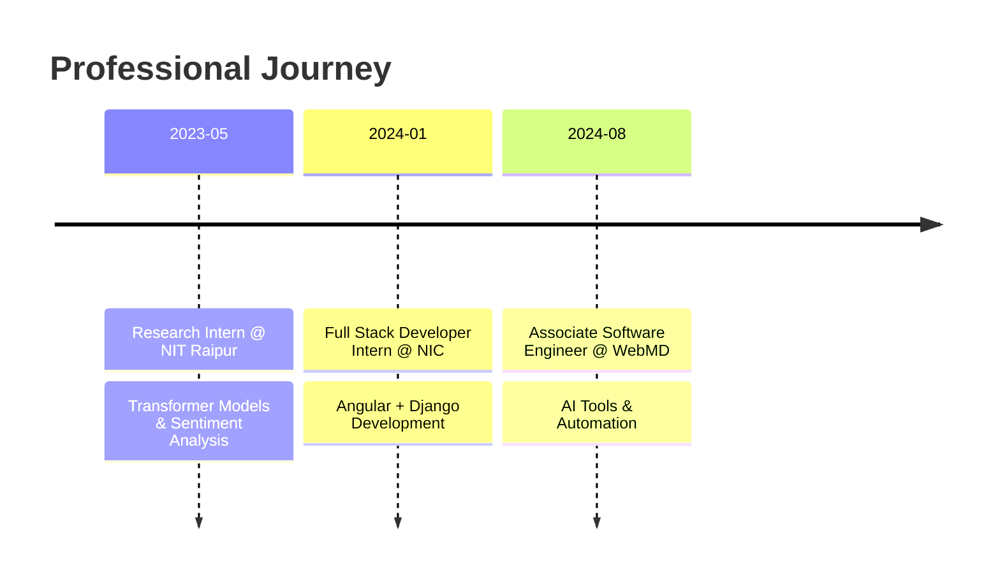

<div align="center">

# ⚡ ANKIT CHHETRI

```ascii
╔═══════════════════════════════════════════════════════════╗
║                                                           ║
║        █████╗ ██╗    ████████╗ ██████╗  ██████╗ ██╗     ║
║       ██╔══██╗██║    ╚══██╔══╝██╔═══██╗██╔═══██╗██║     ║
║       ███████║██║       ██║   ██║   ██║██║   ██║██║     ║
║       ██╔══██║██║       ██║   ██║   ██║██║   ██║██║     ║
║       ██║  ██║██║       ██║   ╚██████╔╝╚██████╔╝███████╗ ║
║       ╚═╝  ╚═╝╚═╝       ╚═╝    ╚═════╝  ╚═════╝ ╚══════╝ ║
║                                                           ║
╚═══════════════════════════════════════════════════════════╝
```

**`Associate Software Engineer @ WebMD`** | **`AI Tool Architect`** | **`Automation Enthusiast`**

[](https://linkedin.com/in/chhetriankit)
[](https://github.com/zetsu012)
[](mailto:ankitchhetri712@gmail.com)


</div>

---

## 🎯 MISSION STATEMENT

```typescript
const ankitChhetri = {
    role: "Software Engineer",
    experience: "1.5 years",
    location: "India 🇮🇳",
    mission: "Automate everything. Build AI-powered solutions. Make developers' lives easier.",
    currentFocus: [
        "AI-Powered Development Tools",
        "SDLC Automation",
        "Developer Productivity Enhancement"
    ],
    impact: "40% increase in internal developer efficiency"
};
```

<div align="center">

### 💭 Philosophy
*"If it can be automated, it should be automated. If it bothers you, build a tool to fix it."*

</div>

---

## 🚀 CURRENT PROJECTS AT WEBMD

<table>
<tr>
<td width="50%">

### 🔮 AI-Powered IDE
```yaml
status: In Development
tech: [VSCode Extension, Cline Fork, Vue.js]
features:
  - Custom proprietary workflow
  - Agile story integration
  - AI-driven code generation
  - Complete SDLC automation
goal: "Planning → Development → Deployment"
```

</td>
<td width="50%">

### 📝 Agile Story Generator
```yaml
status: Production
tech: [Vue 3, FastAPI, Python]
features:
  - Web-based ticket generation
  - Automated user story drafting
  - Streamlined workflow
  - Product team integration
impact: "Automated story creation for teams"
```

</td>
</tr>
</table>

---

## 💻 TECH STACK

<div align="center">

### Frontend Arsenal


### Backend Arsenal


### Database & Cloud


### Tools & Specialties


</div>

---

## 🎓 EXPERIENCE TIMELINE



<details>
<summary><b>📊 Detailed Experience</b></summary>

### 🏥 WebMD - Associate Software Engineer
**August 2024 - Present**
- Developed AI-powered tools increasing developer efficiency by 40%
- Built AI code editor with Vue.js and FastAPI
- Created agile story generation platform
- Forked and customized VSCode with proprietary features
- Integrated A2A and ACP protocols for AI agent networks

### 🏛️ National Informatics Centre - Full Stack Developer Intern
**January 2024 - May 2024**
- Developed eService web application with Angular
- Implemented Django backend with token-based authentication
- Collaborated with teams on service requirements

### 🔬 NIT Raipur - Research Intern
**May 2023 - June 2023**
- Led comparative analysis on transformer models
- Fine-tuned models for sentiment analysis
- Contributed to research paper publication

</details>

---

## 🌟 FEATURED PROJECT

<div align="center">

### 📰 [newsWrapper](https://github.com/zetsu012/newsWrapper)

```
┌─────────────────────────────────────────────────────────┐
│                                                         │
│  Problem: Reading AI news on mobile was inefficient    │
│     ↓                                                   │
│  Solution: Built an API aggregator                     │
│     ↓                                                   │
│  Result: Daily AI insights via WhatsApp ☕             │
│                                                         │
└─────────────────────────────────────────────────────────┘
```

**Tech Stack:** Python | News APIs | WhatsApp Integration

</div>

---

## 🎯 CURRENT EXPLORATION

<div align="center">

| 🤖 AI Agents | 🕸️ Knowledge Graphs | ⚙️ SDLC Automation |
|:---:|:---:|:---:|
| Building centralized AI agent networks using A2A & ACP protocols | Crafting RAG systems with contextual understanding | Automating complete development cycles from planning to deployment |

</div>

---

## 📊 GITHUB STATISTICS

<div align="center">


</div>

---

## 🎓 EDUCATION

```
📚 Sikkim Manipal Institute of Technology
   B.Tech in Information Technology
   CGPA: 8.6/10.0
   2020 - 2024
```

---

## 🤝 LET'S COLLABORATE

<div align="center">

```
╔══════════════════════════════════════════════════╗
║                                                  ║
║  💡 Open to discussing:                          ║
║     • AI-powered automation projects             ║
║     • Developer productivity tools               ║
║     • Knowledge sharing & mentorship             ║
║     • Building innovative solutions together     ║
║                                                  ║
╚══════════════════════════════════════════════════╝
```

### 📫 Reach Me

[](mailto:ankitchhetri712@gmail.com)
[](https://linkedin.com/in/chhetriankit)
[](tel:+919474835712)

</div>

---

<div align="center">

### 💫 Core Beliefs

**`Automate Everything`** • **`Build Solutions`** • **`Stay Curious`** • **`Share Knowledge`**

```
"In a world of manual tasks, be the wizard who makes life magical through code"
```

---

⭐ **Thanks for visiting!** ⭐

*If you find my work interesting, consider starring some repositories!*

</div>
